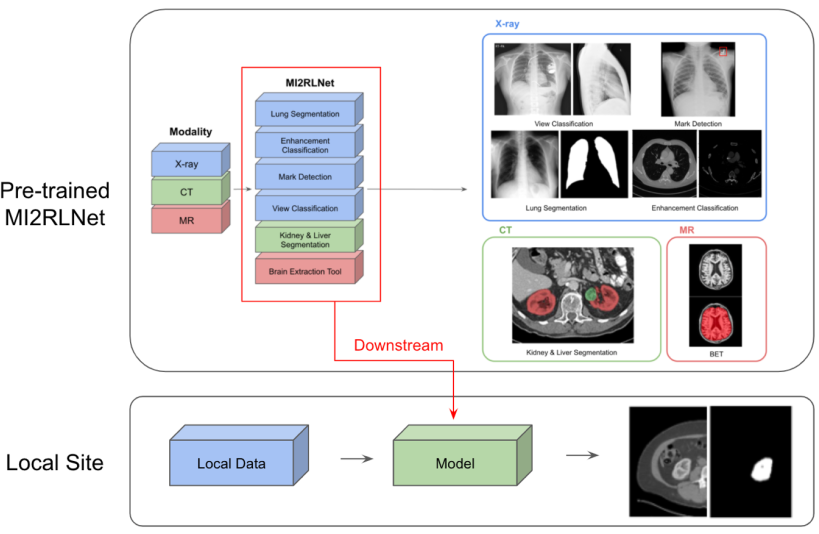

# MI2RLNet



This MI2RLNet is the hub of pretrained models in the medical domain. 

We hope MI2RLNet helps your downstream task.


* **Organizing Team** : MI2RL, Asan Medical Center(AMC), Seoul, Republic of Korea

* **Contributor** 

  * Commiter : Kyuri Kim, Jiyeon Seo, Jooyoung Park, Mingyu Kim, Kyungjin Cho, Daeun Kim, Yujin Nam.

  * Reviewer : Sungman Cho, Sungchul Kim.

  * Data Maintainer : Miso Jang, Namkug Kim.
    
    <br>

* **Docker images**

  * Dockerfille : tf > 2.x, Pytorch 1.x

  * Dockerfile_tf.1.15 : tf < 2.x, Pytorch 1.x

    <br>

## Contents

**Data description**


| Modality  | Part        | Module                                 | Data Reference                                               |
| --------- | ----------- | -------------------------------------- | ------------------------------------------------------------ |
| X-ray     | Chest       | L/R Mark Detection                     | AMC                                                          |
| X-ray     | Chest       | PA / Lateral /Others Classification    | AMC                                                          |
| CT        | Chest       | Enhanced / Non-Enhanced Classification | AMC                                                          |
| CT        | Chest       | Lung Segmentation                      | AMC                                                          |
| CT        | Abdomen     | Kidnet & Tmuor Segmentation            | KiTS 2019 (https://kits19.grand-challenge.org/)              |
| CT        | Abdomen     | Liver Segmentation                     | AMC, LiTS 2017 (https://competitions.codalab.org/competitions/17094) |
| Endoscopy | Colonoscopy | Polyp Detection                        | -                                                            |
| MR        | Brain       | Brain Extraction                       | AMC                                                          |
| MR        | Brain       | blackblood segmentation                | AMC                                                          |


**Experiment results**

| Modality | Part        | Module                                 | Results   | Wiki                                                         | Weights                                                      | Framework |
| -------- | ----------- | -------------------------------------- | --------- | ------------------------------------------------------------ | ------------------------------------------------------------ | --------- |
| X-ray    | Chest       | L/R Mark Detection                     | mAP: 99.28 | [link](https://github.com/mi2rl/private-code-house/tree/master/medimodule/Chest) | [link](https://drive.google.com/file/d/1WbZbDYDx7KxqhufiXh1u54q0DjZbYuew/view?usp=sharing) | TF <1.15  |
| X-ray    | Chest       | PA / Lateral / Others Classification   | Acc: 94.0 (external) | [link](https://github.com/mi2rl/private-code-house/tree/master/medimodule/Chest) | [link](https://drive.google.com/file/d/1iCa-iwrek-efn_zSmFNrxdP5q_UOYuoK/view?usp=sharing) | Keras     |
| CT       | Chest       | Enhanced / Non-Enhanced Classification | Acc: 96.0 (external) | [link](https://github.com/mi2rl/private-code-house/tree/master/medimodule/Chest) | [link](https://drive.google.com/file/d/15S494ac3pUJSD6vEMJlSRi0Y42iM2OoG/view?usp=sharing) | Keras     |
| CT       | Chest    | Lung Segmentation                      | DSC: 97.71 | -                                                            | [link](https://drive.google.com/file/d/1UJ5FEZbBtn85b5hY04Ipb8eZvGkn-h8D/view?usp=sharing) | TF 2.x    |
| CT       | Abdomen | Kidney & Tumor Segmentation            | DSC: 83.07 | [link](https://github.com/mi2rl/private-code-house/tree/master/medimodule/Kidney) | [link](https://drive.google.com/drive/folders/1lsMegnl5AeS90M7n1e-QYgYpr7vX-4yP?usp=sharing) | TF 2.x    |
| CT       | Abdomen | Liver Segmentation                     | DSC: 96.94 | [link](https://github.com/mi2rl/private-code-house/tree/master/medimodule/Liver) | [link](https://drive.google.com/file/d/1oaURDlhh4K7S39XjxnaZShyLeUqvtbLC/view?usp=sharing) | TF 2.x    |
| Endoscopy | Colonoscopy | Polyp Detection             | -    | [link](https://github.com/mi2rl/private-code-house/tree/master/medimodule/Endoscopy) | [link](https://drive.google.com/file/d/1pwePgaYsDCAeNhHXvDgehP-4chQsAGtc/view?usp=sharing) | Pytorch   |
| MR       | Brain       | MRA BET(Brain Extration Tool)          | DSC: 95.28 | [link](https://github.com/mi2rl/private-code-house/tree/master/medimodule/Brain) | - | Pytorch   |
| MR       | Brain       | Black-blood Segmentation               | DSC: 83.7  | [link](https://github.com/mi2rl/private-code-house/tree/master/medimodule/Brain) | [link](https://drive.google.com/file/d/1LMPveqQybGh9EJD9nL1JwPinbUDJjz_y/view?usp=sharing) | TF 2.x    |


## How can we use ?

### Inference (Pytorch Style)

```python
# import the module you want to use
from medimodule.Liver import LiverSegmentation

# initialize the module
module = LiverSegmentation()

# set the model with its well-trained weight
module.init('/path/for/liver/segmentation.h5')

# get a result
mask = module.predict('/path/of/liver.hdr')
```


### Transfer Learning (Pytorch Style)

```python
# construct your model
net = model()

# load dict
net.load_state_dict('/path/for/your/model.pth')

# training
net.train()

# add your train code
```


## Contributing

If you'd like to contribute, or have any suggestions for these guidelines, you can contact us at namkugkim@gmail.com or open an issue on this GitHub repository.

All contributions welcome! All content in this repository is licensed under the Apache 2.0 license.
