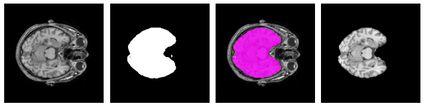
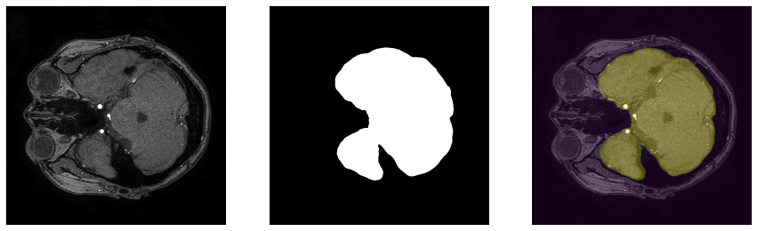
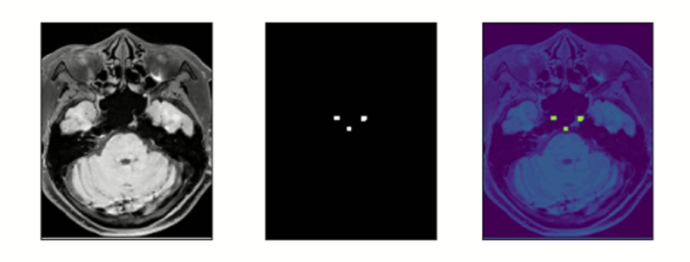

# Brain
This **Brain** module consists of the following functions.
-  MRI BET (Brain Extraction Tool for T1-wegithed MRI, MR angiography)
-  Brain Blackblood segmentation
- (TODO) Brain Aneurysm Segmentation

### Results
| Modality | Part | Module | Results |
| --- | --- | --- | --- |
| T1-weighted MRI | Brain | MRI_BET | 93.4 (DSC) |
| MRA | Brain | MRI_BET | 90.0 (DSC) |
| blackblood | Brain | BlackbloodSegmentation | 83.7 (DSC)|


&#160; 
## MRI BET
- `MRI BET` is the preprocessing tool for skull stripping, or brain extraction in MR modalities(T1-weighted MRI, MRA) using the U-Net from the paper ["U-Net: Convolutional Networks for Biomedical Image Segmentation"](https://arxiv.org/abs/1505.04597)


### Inference

```python
### MRI_BET Example 
from medimodule.utils import Checker
from medimodule.Brain.module import MRI_BET

# Check if the input data type is nifti(.nii)
Checker.check_input_type("path/of/img.nii", "nii")

# Allocate the gpu
Checker.set_gpu(gpu_number, framework="pytorch")

# Set the model with weight
# Choose an appropriate weight according to the data modality
model = MRI_BET("path/of/weight.pth")

# Get a brain tissue mask of the input data
# img_type : MRI modality(T1/MRA)
# save_path : set if you want to save the mask and the skull-stripped image
image, mask = model.predict("path/of/image.nii", 
                            img_type="T1",
                            save_path="path/for/save.nii")
```

#### Result of T1-weighted MRI BET
</img>

#### Result of MRA BET
</img>

### Reference
- [UNet] - [code](https://github.com/milesial/Pytorch-UNet)


&#160;  
## Blackblood Segmentation
- The objective of this `blackblood segmentation` is to get the black blood vessel in brain MRI.

### Inference
```python
from medimodule.utils import Checker
from medimodule.Brain.module import BlackbloodSegmentation

# Check if the input data type is nifti(.nii)
Checker.check_input_type("path/of/img.nii", "nii")

# Allocate the gpu
Checker.set_gpu(gpu_idx, framework="tf2")

# set the model with weight
model = BlackbloodSegmentation("path/of/weight.h5")

# get a blackblood mask of the image
# save_path : set if you want to save the mask
image, mask = model.predict("path/of/image.nii", 
                            save_path="path/for/save.nii")
```

### Sample
</img>
