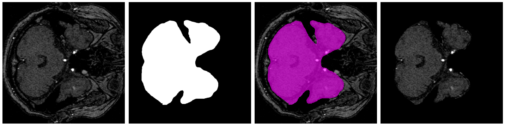

# Brain
This **Brain** module consists of the following functions.
-  MRI BET (Brain Extraction Tool for T1-wegithed MRI, MR angiography)
-  Brain Blackblood segmentation
- (TODO) Brain Aneurysm Segmentation

### Results
| Modality | Part | Module | Results |
| --- | --- | --- | --- |
| T1-weighted MRI | Brain | MRI BET | 93.35 (DSC%) |
| MRA | Brain | MRI BET | - |
| blackblood | Brain | Brain blackblood Segmentation | 0.837 |


&#160; 
## MRI BET
- `MRI BET` is the preprocessing tool for skull stripping, or brain extraction in MR modalities(T1-weighted MRI, MRA) using the U-Net from the paper ["U-Net: Convolutional Networks for Biomedical Image Segmentation"](https://arxiv.org/abs/1505.04597)


### Inference

```python
### MRI_BET Example 
from medimodule.Brain.module import MRI_BET
from medimodule.utils import Checker

check = Checker()
mri_bet = MRI_BET()

# Check if the input data type is nifti(.nii)
check.check_input_type('path/of/img.nii', 'nii')

# Allocate the gpu
check.set_gpu(gpu_number, framework='pytorch')

# Set the model with weight
# Choose an appropriate weight according to the data modality
mri_bet.init('path/of/weight.pth')

# Get a brain tissue mask of the input data
# img_type : MRI modality(T1/MRA)
# save_mask : set True if you want to save the binary bet mask
# save_stripping : set True if you want to save the skull-stripped image
mask = mri_bet.predict('path/input_img.nii', 
                            img_type='T1',
                            save_mask=True, 
                            save_stripping=True) 
```

#### result of T1-weighted MRI BET
</img>

#### result of MRA BET
</img>

### Weights
- TODO

### Reference
- [UNet] - [code](https://github.com/milesial/Pytorch-UNet)


&#160;  
## Blackblood Segmentation
- The objective of this `blackblood segmentation` is to get the black blood vessel in brain MRI.

### Inference
```python
from medimodule.Brain.module import BlackbloodSegmentation
from medimodule.utils import Checker

check = Checker()
blackblood = BlackbloodSegmentation()

# check if the input is nifti file(.nii)
check.check_input_type('path/of/img.nii', 'nii')
# allocate the gpu
check.set_gpu(gpu_idx, framework='tf2')

# set the model with weight
blackblood.init('path/of/weight.h5')

# get a blackblood mask of the image
mask = blackblood.predict('/path/of/blackblood_mask.nii')
```

### Sample
</img>


&#160;  
## (Todo) Brain Aneurysm Segmentation
