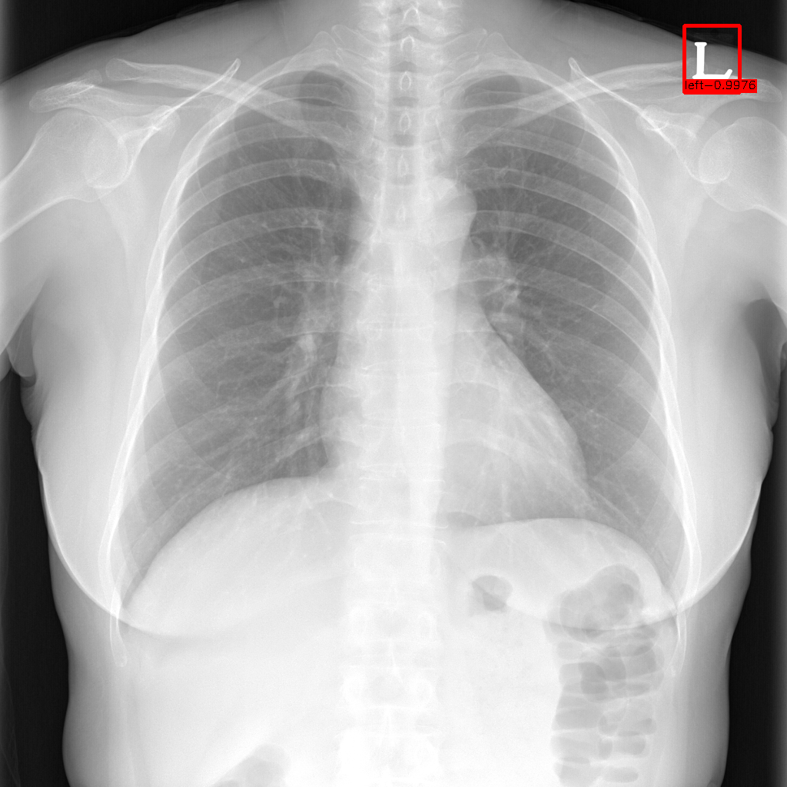

# Chest
This **Chest** module consists of the following functions.
- L,R Mark Detection

### Results
| Modality  | Module | Results |
| ---  | --- | --- |
| X-ray  | Chest L,R Mark Detection | b0 mAP:99.28% |


## Chest L,R Detection
The objective of this `Chest L,R Mark Detection` submodule is to get the prediction box in chest X-ray.

### Inference

```python
from Chest import ChestLRDetection
detection = ChestLRDetection()
# set the model with weight
detection.init(args.weights)
# get a Prediction image
predict = detection.predict(args.img)
```

</img>

### Weights

[weights link](https://drive.google.com/file/d/1WbZbDYDx7KxqhufiXh1u54q0DjZbYuew/view?usp=sharing)

### Reference

[EfficientDet] [Code](https://github.com/xuannianz/EfficientDet) - [Paper](https://arxiv.org/pdf/1911.09070.pdf)


