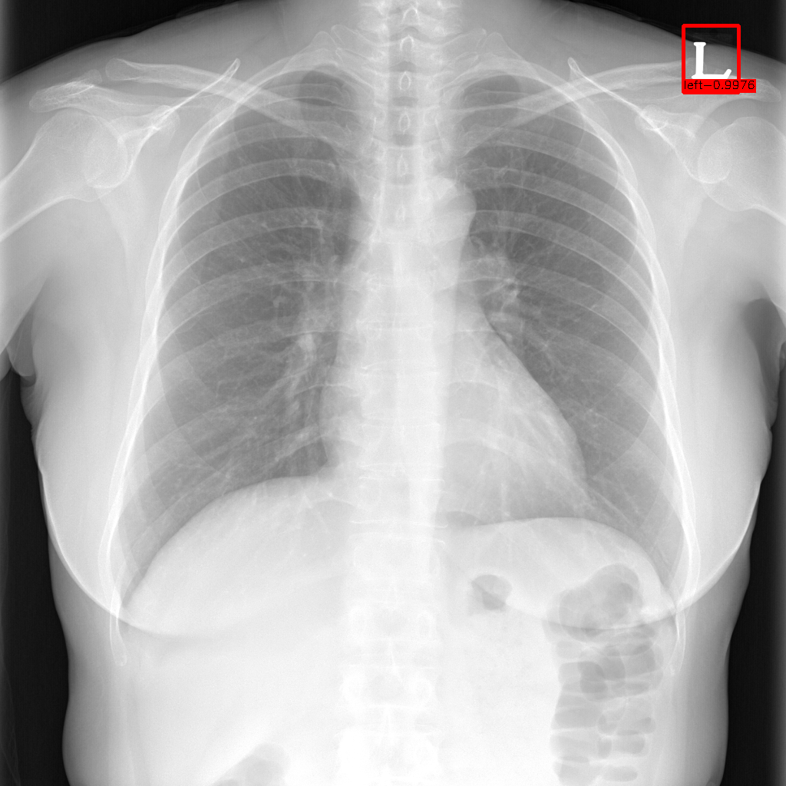
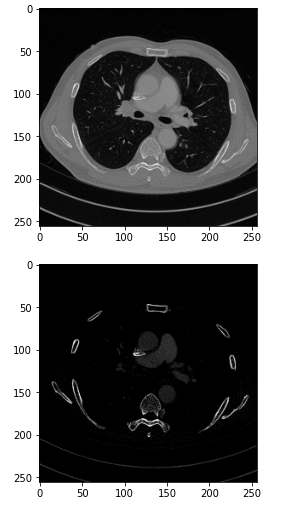
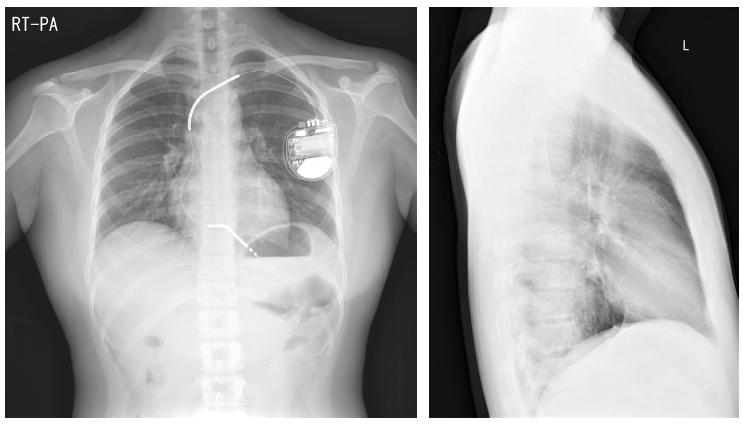

# Chest
This **Chest** module consists of the following functions.
- Lung Segmentation
- L,R Mark Detection
- PA / Lateral / Others Classification
- Contrast / Non-Contrast Classification
  
## Results
| Modality  | Part | Module | Results |
| ---  | --- | --- | --- |
| X-ray | Chest | Lung Segmentation | 0.97 (DSC) |
| X-ray | Chest | L,R Mark Detection | 0.99 (mAP) |
| X-ray | Chest | PA / Lateral / Others Classification | 0.94 (Acc) |
| CT | Chest | Contrast / Non-Contrast Classification | 0.96 (Acc) |

<br>

---
## Lung Segmentation
- The objective of `Lung Segmentation` is to get the lung mask in chext x-ray.

### Inference
```python
from medimodule.Chest import LungSegmentation

# Set the model with weight
model = LungSegmentation("path/of/weight")

# Get a lung mask of the image
image, mask = model.predict("path/of/image", save_path="path/for/save")
```

### Sample


<br>

---
## L,R Mark Detection
- The objective of `L,R Mark Detection` is to get the prediction box about L or R mark in chest X-ray.

### Inference
```python
from medimodule.Chest import LRmarkDetection

# Set the model with weight
model = LRmarkDetection("path/of/weight")

# Get a result of the image
image, result = model.predict("path/of/image", save_path="path/for/save")
```

### Sample
</img>

### Reference
[EfficientDet] [Code](https://github.com/xuannianz/EfficientDet) - [Paper](https://arxiv.org/pdf/1911.09070.pdf)


<br>

---
## Enhanced / Non-Enhanced Classification  
- The objective of `Enhanced CT Classification` is to identify whether enhanced CT or not in lung CT slices.

### Inference
```python
from medimodule.Chest.module import EnhanceCTClassifier

# Set the model with weight
model = EnhanceCTClassifier("path/of/weight")

# Get a result of the image
## Input image must have 2 channels.
## 1: Original
## 2: L550 / W737 (windowing)
image, result = model.predict("path/of/image", save_path="path/for/save")
```

### Input image example
</img>


<br>

---
## PA / Lateral / Others Classification  
- The objective of `PA / Lateral / Others Classification` is to classify PA, Lateral, and others in chest X-ray.

### Inference
```python
from medimodule.Chest.module import ViewpointClassifier

# Set the model with weight
model = ViewpointClassifier("path/of/weight")

# Get a result of the image
image, result = model.predict("path/of/image", save_path="path/for/save")
```

### Input image example
</img>