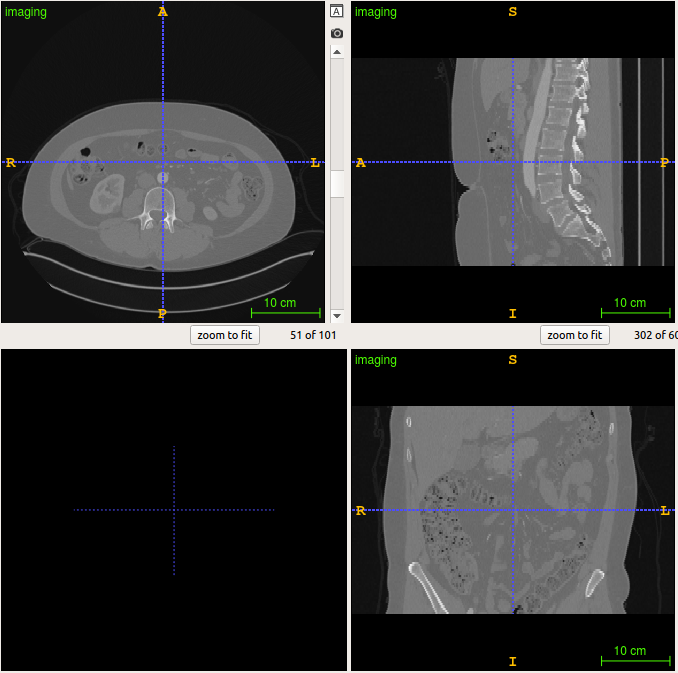
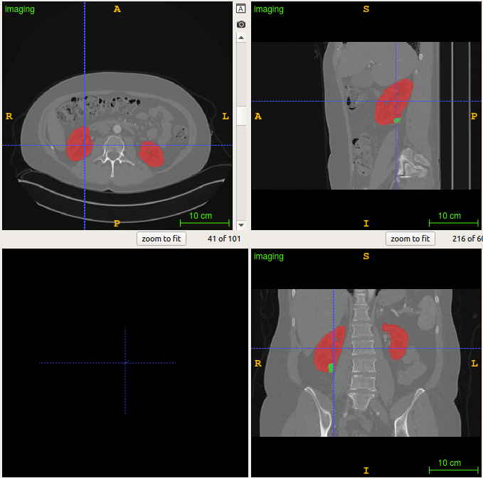

# Kidney 
This **Liver** module consists of the following functions.
- Kidney Tumor Segmentation


## Kidney and Tumor Segmentation
The objective of this `Kidney and Tumor Segmentation` submodule is to get the kidney and tumor mask of arterial phase abdominal CT scans. 

### Inference
```python
from medimodule.Kidney import KidneyTumorSegmentation

module = KidneyTumorSegmentation()

# set the model with weight
module.init(args.mode, args.weights)

# get a result
result = module.predict(args.mode, args.img)

# get a kidney mask of the image
mask = module.predict(args.mode, args.img)
```
All checkpoints are located in `checkpoint/`. Checkpoints used in challenges will be updated.
- For searching ROI of kidney  
  `python evaluation.py --mode 1 --testset /path/testset`
- For predicting kidney and tumor  
  Select a mode using prediction. Before predicting kidney and tumor, **RUN** the mode 1 first.  
  2_1 : coreline's model
  2_2 : model with dice loss, normalization with tumor's mean and std and using **ONLY ONE** kidney in CT.  
  2_3 : model with dice loss, minmax scaling and using **ALL** kidney in CT.  
  2_4 : model with focaldice loss, minmax scaling and using **ALL** kidney in CT.  
  2_5 : model with dice loss, normalization with tumor's mean and std and using **ALL** kidney in CT.  
  `python evaluation.py --mode 2_3 --testset /path/testset`

| 


### Weights
Weights : https://github.com/mi2rl/private-code-house


### Dataset : KiTS19_ACE
KiTS 2019 challenge in MICCAI 2019 https://kits19.grand-challenge.org/ 

Team name : ACE (Asan Coreline Ensemble)  
http://results.kits-challenge.org/miccai2019/manuscripts/sungchul7039_3.pdf


