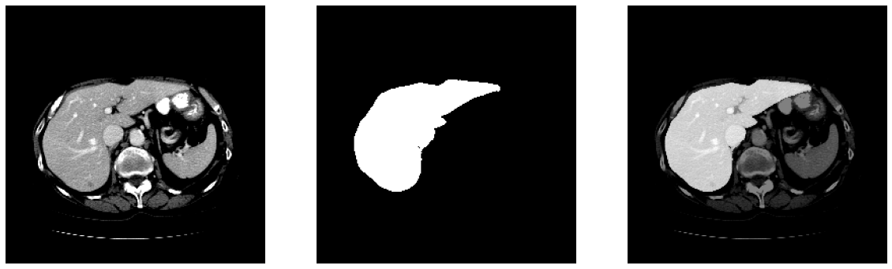

# Liver

## Liver Segmentation
### Running
```python
from medimodule.Liver.module import LiverSegmentation

module = LiverSegmentation()

# set the model with weight
module.init('/path/for/liver/segmentation.h5')

# get a liver mask of the image
mask = module.predict('/path/of/liver.hdr')
```
### Sample
</img>
  
## Liver Vessel Segmentation
- TODO
  
## Liver HCC Segmentation
- TODO
  
## Liver Registration
- TODO
  