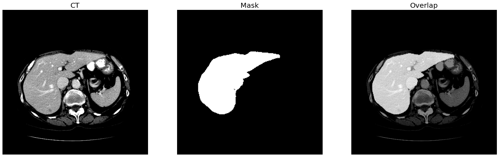

# Liver
This **Liver** module consists of the following functions.
- Liver Segmentation
- (TODO) Hepatic Vessel Segmentation
- (TODO) HCC (Hepatocellular carcinoma) Segmentation

### Results
| Modality |  Part   |                   Module                    | Results |
| -------- | ------- | ------------------------------------------- | ------- |
|    CT    | Abdomen |             Liver Segmentation              |   0.98  |
|    CT    | Abdomen |         Hepatic Vessel Segmentation         |    -    |
|    CT    | Abdomen | HCC (Hepatocellular carcinoma) Segmentation |    -    |


## Liver Segmentation
The objective of this `Liver Segmentation` submodule is to get the liver mask in abdominal CT.

### Inference

```python
from medimodule.Liver import LiverSegmentation

module = LiverSegmentation()

# set the model with weight
module.init('/path/for/liver/segmentation.h5')

# get a liver mask of the image
mask = module.predict('/path/of/liver.hdr')
```
</img>

### Weights
- [link](https://drive.google.com/file/d/1oaURDlhh4K7S39XjxnaZShyLeUqvtbLC/view?usp=sharing)


  
## Liver Vessel Segmentation
- TODO
  
## Liver HCC Segmentation
- TODO
