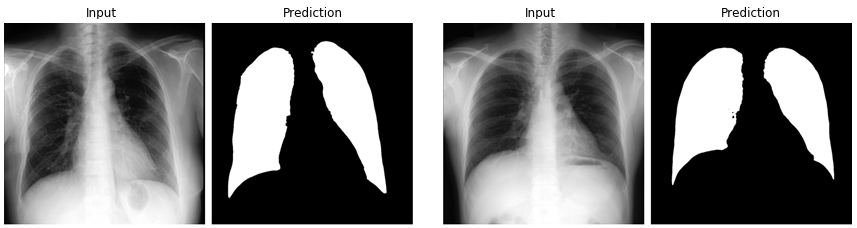

# Lung
This **Lung** module consists of the following functions.
- Lung Segmentation

### Results
| Modality | Module | Results |
| --- | --- | --- |
| CXR | Lung Segmentation | Dice 0.97 |


## Lung Segmentation
The segmentation model trained by `JSRT` dataset. 

### Inference

```python
from medimodule.Lung import LungSegmentation

module = LungSegmentation()

# set the model with weight
module.init('/path/for/lung/Lung_segmentation.hdf5')

# get a result
result = module.predict('/path/of/lung.png')
```


### Weights

[weights link](https://drive.google.com/file/d/1UJ5FEZbBtn85b5hY04Ipb8eZvGkn-h8D/view?usp=sharing)

